# jrSTL
本项目的目的是学习C++11标准下的STL容器库、算法库和智能指针库，其实现了：  
1. 所有容器与容器适配器；
2. ```<algorithm>```头文件中所有泛型算法；
3. ```<iterator>```头文件中所有迭代器相关内容；
4. 无状态的简易空间配置器（封装了new/delete）；
5. 智能指针库（unique/shared/weak_ptr）。  
 
## 1 概述
### 1.1 实现上的特点
1. 采用AVL平衡二叉树而非红黑树作为set/map的底层存储结构；       
2. 在关联容器中，使用一个基类来统一xxx/multixxx共有的操作，一个bool类型模板参数来控制是否保留相同的键值，有效降低了重复代码率；     
3. search算法中，若分配缓存成功，则采用KMP算法进行模式匹配；    
4. sort算法中，若递归深度小于阈值且剩余元素个数大于阈值，则采用快速排序算法；若递归深度大于阈值则采用归并排序；若剩余元素个数较少则采用插入排序；  
5. 可在jr_iterator.h文件中通过USE_STD_TRAITS宏定义来控制该库是否支持std的迭代器原语tag。  
### 1.2 测试结果
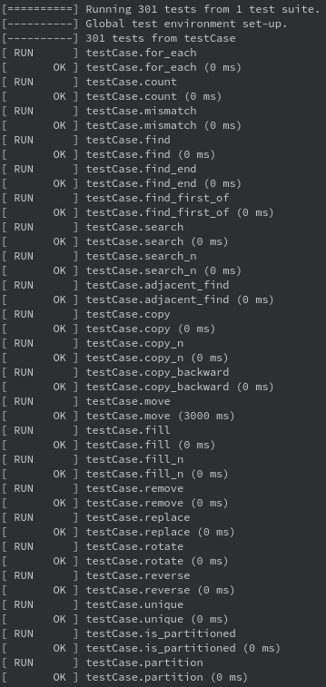  
......  
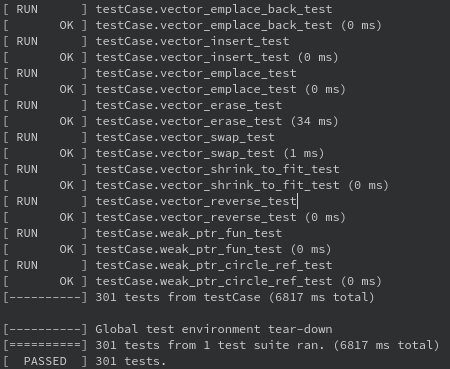

## 2 迭代器
jrSTL实现了C++11标准下的迭代器原语、迭代器操作、迭代器范围访问和所有迭代器适配器。
### 2.1 迭代器类型
1. 输入迭代器——Input iterator  
只读迭代器，**只能用于读取数据，不可写入数据**。
2. 输出迭代器——Output iterator  
只写迭代器，**只能写入数据，不可读取数据**。
3. 前向迭代器——Forward iterator  
可读可写，**只能执行++操作**。  
4. 双向迭代器——Bidirectional iterator  
可读可写，**可执行++与--操作**。
5. 随机迭代器——Random iterator  
可读可写，**可以与原始指针一样进行算术运算，比如+=，-=等**。
### 2.2 迭代器适配器
### 2.2.1 插入迭代器——Insert iterator
作用是向容器内插入元素，常配合标准算法一起使用（因为若向标准算法传入普通迭代器，标准算法无法改变容器的大小），**其类型为Output iterator，只能写入数据，不允许遍历（即++、--、+=等操作）、读取数据（即解引用迭代器，*操作）**。
### 2.2.2 流迭代器——Stream iterator
作用是向流中输入元素。  
1. **输入流迭代器（istream iterator）类型为Input iterator，只能从流中读取数据（operator>>），不允许遍历、写入数据**；
2. **输出流迭代器（ostream iterator）类型为Output iterator，只能向流中写入数据（operator<<），不允许遍历（即++、--、+=等操作）、读取数据（即解引用迭代器，*操作）**。
### 2.2.3 反向迭代器——Reverse iterator
作用是为容器提供反向遍历的迭代器，类型与其正向迭代器一致，实现的关键在于**解引用时（即operator*）返回当前正向迭代器的前一个位置的值**。  
### 2.2.4 移动迭代器——Move iterator（C++11）
作用是在解引用时返回底层迭代器对应值的右值。

## 3 容器库
jrSTL实现了C++11标准下的所有容器和容器适配器。
### 3.1 顺序容器
### 3.1.1 array（C++11）
array本质上是原生栈上数组的封装，其内部最重要的成员是一个原生的栈上数组。在具体的实现中，由于标准中std::array支持聚合初始化，因此该原生数组只能为public成员。
### 3.1.2 vector
vector的特点是其大小可以动态增长，其**支持Random iterator**；vector实际所占的内存大小称为capacity，用户可见的vector大小称为size；其实现有两个关键点：  
1. 动态扩容  
若当前容量（capacity，而非size）不足以容纳新入元素，则会发生动态扩容。  
动态扩容不是在当前使用的空间后续接新空间，而是**分配一段足够大小的新空间，将旧空间原有数据全部拷贝到新空间，再在新空间上进行操作，释放旧空间**。由此，将导致vector的一个特点（或者说是bug吧）：**一旦发生动态扩容，将导致原来的迭代器全部失效！！**
2. 尽量减少数组扩容次数  
由上述可见，若动态扩容经常发生，将导致程序频繁的申请内存，这样一来会导致效率低下。因此，在具体实现中，**发生动态扩容时，都会分配当前所需大小两倍的空间**。  
### 3.1.3 deque
deque**支持random_iterator**，本质上是双向队列；**其与vector的根本区别在于其内存组织方式与vector不一样**，由此导致deque的两个特点：
1. deque在头端插入/移除元素的时间复杂度为O(1)，而vector为O(N)；  
2. deque不存在capacity概念。  
#### deque采用**分段的线性连续空间**来组织其内部数据，分段的线性连续空间又由控制器map（名字为map，与std::map无关）来进行控制；控制器map与各个连续线性空间（称为缓冲区）的关系如下图所示：  
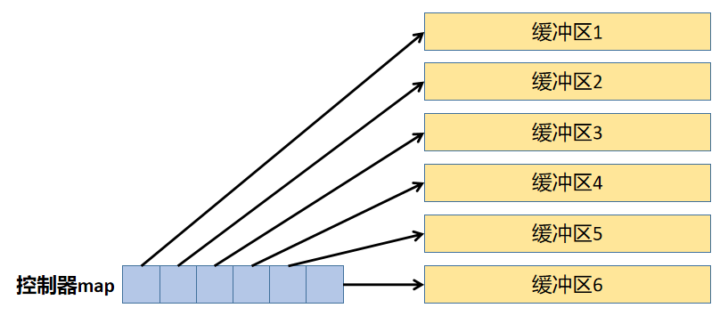  
为了向用户提供deque整体连续的逻辑，因而deque的迭代器需要与控制器map紧密合作；deque迭代器至少需要如下图所示的4个成员：  
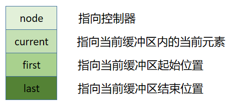  
deque迭代器与控制器map协同工作过程：  
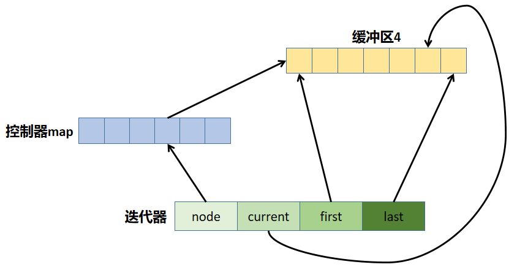
### 3.1.4 forward_list（C++11）
forward_list**支持forward_iterator**，本质上就是单向链表；其**由单向链表（或单向环形链表）** 实现，具有三个特点：  
1. 由于单向链表的性质（指针指向某个node时，只能删除当前node之后的node，无法删除之前的，也就是丢失了当前node之前的信息），因此forward_list的API只支持xxx_after，与其他容器不同——比如其他容器进行erase操作，删除的是当前迭代器所指向的内容，而**forward_list的erase操作是删除当前迭代器之后的一个迭代器所指向的内容**。
2. 考虑到其不支持random_iterator，因此**排序应当使用forward_list::sort（采用归并排序实现）**，而非算法库中的sort（插入排序+堆排序+快速排序）。  
3. forward_list::reverse在具体实现时使用原地反转算法。
### 3.1.5 list
list**支持bidirectional_iterator**，本质上是双向链表；其**由双向链表（或双向环形链表）** 实现，具有两个特点：  
1. 考虑到其不支持random_iterator，因此**排序应当使用list::sort（仍然采用归并排序实现）**，而非算法库中的sort。
2. list::reverse在具体实现时使用原地反转算法。
### 3.2 关联容器
### 3.2.1 set/multiset/map/multimap
set/multiset/map/multimap**支持bidirectional_iterator**，它们内部均**采用平衡二叉搜索树实现**（在本库中使用AVL树，而大多数STL实现中采用RB树），且遍历容器将得到已排序序列（这是由二叉搜索树特性决定的）；平衡二叉搜索树具体实现见container/utils/jr_tree.h中的_AVL_Tree类。  
本库的实现具有以下特点：  
1. set与multiset继承自同一基类_set_base，map/multimap继承自同一基类_map_base，目的是减少重复代码。  
2. multi与否由基类_xxx_base的模板参数bool isMultiXxx在编译期决定。
3. multixxx中，相同的值将首先插入在已有值的右子树中，再进行平衡性调整。  
#### 注：map/multimap中，元素类型为
```c++ 
std::pair<const Key, Value>
```
### 3.2.2 unordered_xxx（C++11）
unordered_xxx**支持forward_iterator**，它们内部均**采用哈希表实现**——具体来说，哈希方法可由用户定制，但**碰撞检测和避免采用桶方法（因为线性探测和平方探测并不能百分之百避免碰撞发生，而桶方法可以）**；哈希表具体实现见container/utils/jr_hashtable.h中的_hashtable类。 
本库的实现具有以下特点：  
1. unordered_set与unordered_multiset继承自同一基类_hashset_base，unordered_map/unordered_multimap继承自同一基类_hashmap_base，目的是减少重复代码。  
2. multi与否由基类_hashxxx_base的模板参数bool isMulti在编译期决定。
3. 桶方法中的桶采用单向链表顺序容器forward_list实现，目的在于减少重复代码（其实改进的话也可以采用AVL树实现）。  
#### 底层hashtable逻辑结构如下图所示。  
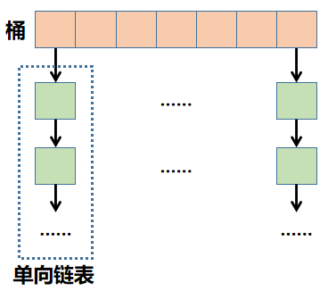
### 3.3 容器适配器
### 3.3.1 stack
采用顺序容器作为内部结构，实现FILO逻辑，其**没有迭代器，也没有遍历行为**。
### 3.3.2 queue
采用顺序容器作为内部结构，实现FIFO逻辑，其**没有迭代器，也没有遍历行为**。
### 3.3.3 priority_queue
采用顺序容器作为内部结构，借助算法库中的heap相关算法，实现heap逻辑，**默认为最大堆**， 其**没有迭代器，也没有遍历行为**。

## 4 算法库
jrSTL实现了C++11标准```<algorithm>```头文件中的所有泛型算法，以下只挑选几个实现时比较有意思的来介绍。
### 4.1 copy
**源区间与目的区间不可以重合**。
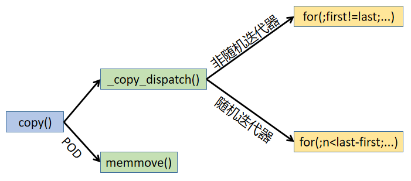
### 4.2 sort
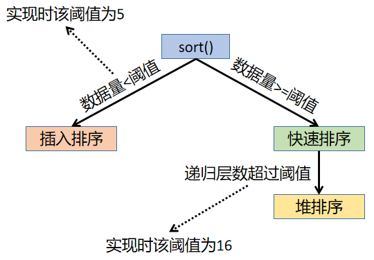
### 4.3 rotate
前向迭代器  
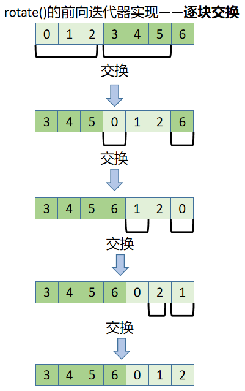  
双向迭代器与随机迭代器    
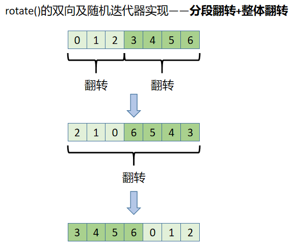

## 5 智能指针（C++11）
### 5.1 unique_ptr
这个没什么好说的，相当于原始指针的RAII封装；**unique_ptr禁止有copy行为**。
### 5.2 shared_ptr
### 5.2.1 shared_ptr内部结构
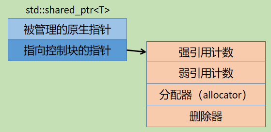  
上述结构将带来如下的特点：    
1. std::shared_ptr的尺寸是原生指针的两倍（因为内含两个指针）；  
2. 控制块的内存必须动态分配；  
3. 为保证线程安全，**引用计数的递增和递减必须是原子操作**；  
4. 当同一个原生指针构造多个std::shared时，将导致多个控制块被创建，也会初始化多个引用计数，将导致内存泄漏和未定义行为。  
5. 由于自定义删除器和分配器并未存储在std::shared_ptr内部，因此**自定义删除器和分配器不会改变std::shared_ptr的尺寸**，而std::unique_ptr则相反。
### 5.2.2 自定义删除器存储于控制块内的实现原理
采用类型擦除技术（可通过继承实现），将自定义删除器存储于控制块内。
### 5.2.3 std::make_shared
1. 异常安全   
2. **相比于调用std::shared_ptr构造函数和new表达式，其效率更高**：std::shared_ptr<T>(new T())进行两次内存分配，一次是new，一次是给控制块分配内存；而std::make_shared<T>()**只进行一次内存分配**，其将被控制的指针所指向的对象与控制块一次性一起分配到一片连续内存中，即将对象T和控制块一起分配到一块内存中。
### 5.3 weak_ptr
### 5.3.1 用途
辅助std::shared_ptr，主要用于：  
1. 检测std::shared_ptr所管理的对象是否空悬；  
2. 打破**循环引用**。
### 5.3.2 循环引用
两个类互相持有指向对方的std::shared_ptr，则二者类对象指针也有std::shared_ptr管理时，将造成循环引用。  
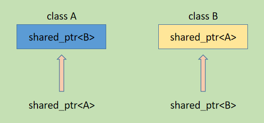    
```c++
struct B;

struct A {
 std::shared_ptr<B> _b;
};

struct B {
 std::shared_ptr<A> _a;
};
 
int main() {
  // 使用智能指针管理类对象指针
  std::shared_ptr<A> a = std::make_shared<A>();
  std::shared_ptr<B> b = std::make_shared<B>();
  // 将类A成员_b指向类B对象
  a->_b = b;
  // 将类B成员_a指向类A对象
  b->_a = a;
  // 产生循环引用，指针a和指针b指向的对象均无法由std::shared_ptr析构。
  return 0;
}
```
### 5.3.3 利用weak_ptr打破循环引用
将5.3.2中类A、B中的成员智能指针中的一个声明为std::weak_ptr即可；原理是weak_ptr只改变弱引用计数，不会改变与shared_ptr释放资源有关的强引用计数，打破了循环。  
注：**std::shared_ptr在强引用计数为0时释放其所管理的资源，但在弱引用计数为0时才释放控制块**。
```c++
struct B;

struct A {
  std::weak_ptr<B> _b;    // weak_ptr
};

struct B {
 std::shared_ptr<A> _a;
};
 
int main() {
  // 使用智能指针管理类对象指针
  std::shared_ptr<A> a = std::make_shared<A>();
  std::shared_ptr<B> b = std::make_shared<B>();
  // 将类A成员_b指向类B对象
  a->_b = b;
  // 将类B成员_a指向类A对象
  b->_a = a;
  // 产生循环引用，但仍可正确释放资源
  return 0;
}
```

## 附：文件目录结构与文件说明    
├── algorithm  
│   ├── jr_algo_buffer.h  采用RAII方式管理资源的、在algorithm中存在的缓存数据段       
│   ├── jr_algorithm.h  算法库，包含了除未初始化内存操作外的所有C++11中的算法  
│   └── jr_numeric.h  数值库的一部分，包含一些简单的数值算法  
├── CMakeLists.txt  
├── container  
│   ├── adapter  容器适配器  
│   │   ├── jr_priority_queue.h  优先队列（二叉堆）    
│   │   ├── jr_queue.h  队列  
│   │   └── jr_stack.h  栈  
│   ├── associate  关联容器  
│   │   ├── jr_map.h  包含map/multimap  
│   │   ├── jr_set.h  包含set/multiset  
│   │   ├── jr_unordered_map.h  包含unordered_map/unordered_multimap  
│   │   └── jr_unordered_set.h  包含unordered_set/unordered_multiset  
│   ├── sequence  顺序容器  
│   │   ├── jr_array.h  
│   │   ├── jr_deque.h  
│   │   ├── jr_forward_list.h  
│   │   ├── jr_list.h  
│   │   └── jr_vector.h  
│   └── utils  单独拿出来的一些容器中的工具类  
│       ├── jr_hashtable.h  哈希表实现  
│       ├── jr_heap.h  二叉堆实现    
│       ├── jr_iterators.h  各种容器的迭代器实现  
│       ├── jr_nodes.h  在容器中用到的链式结构的节点定义  
│       └── jr_tree.h  AVL平衡二叉搜素树实现  
├── functional  
│   └── jr_functional.h  
├── iterator  
│   └── jr_iterator.h  包含迭代器原语、特性萃取机、迭代器适配器等内容  
├── main.cpp  单元测试的主函数  
├── memory  
│   ├── jr_allocator.h  空间分配器  
│   └── jr_smart_ptr.h  智能指针  
└── test  单元测试文件  
    ├── algorithm_test.cpp  
    ├── array_test.cpp  
    ├── deque_test.cpp  
    ├── forward_list_test.cpp  
    ├── hash_map_test.cpp  
    ├── hash_multimap_test.cpp  
    ├── hash_multiset_test.cpp  
    ├── hashset_test.cpp  
    ├── list_test.cpp  
    ├── map_test.cpp  
    ├── multimap_test.cpp  
    ├── multiset_test.cpp  
    ├── priority_queue_test.cpp  
    ├── queue_test.cpp  
    ├── set_test.cpp  
    ├── shared_ptr_test.cpp  
    ├── stack_test.cpp  
    ├── unique_ptr_test.cpp  
    ├── vector_test.cpp  
    └── weak_ptr_test.cpp   
